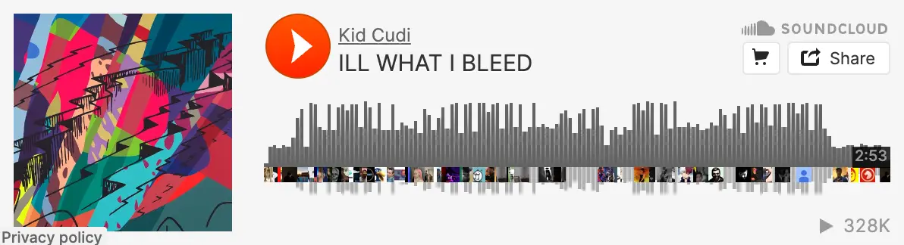
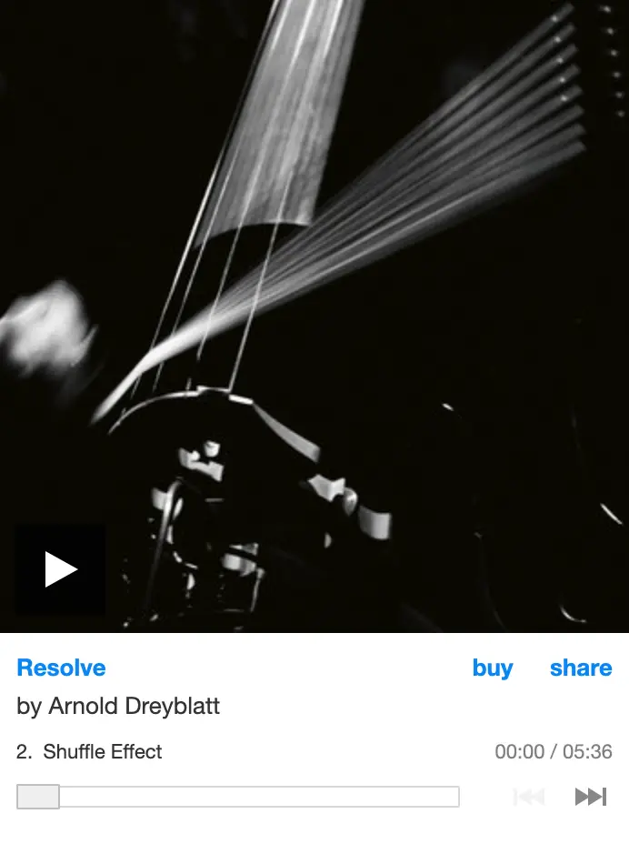

# Music Player

*Be sure to carefully read all instructions before you begin as Content, Styling, and Interactivity requirements may influence various design decisions.*

## Description
A stylish music player built using HTML, CSS, and JS that includes album art, controls, and a time readout.

## Requirements
### Prep
1. Choose one song by a favorite musical artist or group. If possible, download the audio file for the song (ideally as an mp3). Otherwise, a sample mp3 file is provided for you in this repository.
2. Find and download a high-quality version of the artwork for the album that this song appears on - you will be designing this music player around the album art. Compress and reduce the image size as needed using [Squoosh](https://squoosh.app/) or your preferred image editing application.
3. When creating your sketches and wireframes for this project, think about how music players from sites like [Bandcamp](https://bandcamp.com) and [Soundcloud](https://soundcloud.com) appear when they are embedded in other sites (see examples below). Your music player should similarly be thought of as a small "component" or "module" of a larger layout, filling only a portion of a fullscreen window. Do not replicate these example players - your design should be original and only needs to include the elements listed in the Content section below.

### Content
You will need:
- `<input type="range">`

1. Build out the structure of your HTML with the following required elements:
	- Artist name, album title, and song title
	- Album art
	- Play/pause button
		- Either one button that alternates between 2 states or two buttons that are only visible when needed (one at a time)
	- `<input type="range">` slider for playback progress and seek control 
	- Current time readout as `m:ss`
2. The end of the `<body>` should include a well-organized Documentation section based on your Documentation Template project that includes the original sketch and wireframe images and a placeholder for a short written reflection that will be added later.

### Styling
1. Develop a cohesive aesthetic and layout through color and other style properties that relate to your theme:
	- Reference your image when making style choices (e.g. match important colors, imitate angular or organic shapes, complement the tone of the subject matter, etc).
	- Although responsiveness is not required, it is highly recommended to construct your layout using flexboxes. It is typically much easier to achieve consistent alignment, proportions, and spacing with flexbox.
2. Neither the width or height of your layout should exceed`550px`.

### Interactivity
You will need:
- Audio element `play()` and `pause()` methods
- Audio element `currentTime` and `duration` properties
- Conditionals (`if` statements - use either for play/pause button state or `m:ss` formatting)
- `innerText` property
- Input element `value` property
- Operations (arithmetic and string concatenation)
- `setInterval()`

1. Add an event listener to the play/pause button(s) that alternates playing and pausing of the audio file and toggles visual state of the button. 
	- Button visual state can be managed using `classlist.Toggle()` to show or hide one of two buttons with `display: none`, changing the `src` attribute of an `` inside the button, or changing the button's `innerText` property, depending on your specific design requirements.
2. Write a function that does the following:
	- Get the `currentTime` of the audio element.
	- Use operators to create 2 versions of this time value - one scaled to a range of 0-100, and another formatted as `m:ss`. You will need the audio element's total `duration` to calculate the former. Also, the seconds of the `m:ss` version should have a leading 0 when less than 10, e.g. `3:09`.
	- Update the value of the playback progress slider using the 0-100 scaled version.
	- Update the `innerText` of your time readout element using the `m:ss` version.
	- Schedule this function to run every second using `setInterval()`.
3. Add an event listener to the slider that uses the slider value to set the `currentTime` of the audio element. Since the slider has a range of 0-100, you will need to scale this value to the duration of the audio file.

### Finishing Up
1. Manually adjust your code as needed so that the page loads with the play button ready.
2. Write a 2-5 sentence reflection paragraph and paste it into the placeholder. This reflection should describe your concept and summarize the overall design process. Your writing should be formal, concise, and directed at a professional audience. Avoid self-deprecation and generic statements (e.g. "I'm happy with how this turned out").

## Submission
1. Make sure that your code is [formatted using the built-in formatting tools](https://ims322.ersheff.com/docs/style-guide.html#formatting).
2. In the Source Control panel of VS Code:
	1. Stage all changes by clicking the + next to Changes.
	2. Enter "finished" as a commit message and click the Commit button.
	3. The Commit button should change to a Sync Changes button. Click this to finish syncing the latest changes to your GitHub Repository.
3. Return to your assignment repository on GitHub.
	1. Go to Settings and navigate to the Pages section.
	3. Under Branch, choose "main" and click Save.
	4. After a few moments, if you refresh this page, there should now be a URL near the top next to a Visit Site button. If you click this button, you should see your site open in a new window.
4. Copy the URL generated by GitHub Pages, paste it in the Website URL field of the corresponding Canvas Assignment, and click Submit Assignment.

## Grading
- Items listed under "You will need" in each section above are required unless marked as optional. These are the main areas of assessment for your coding.
- You submission should adhere to the [Expectations](https://ims322.ersheff.com/docs/style-guide.html#expectations) from the IMS322 Style Guide, including file organization, font choice, layout and styling specifications, etc.
- Your submission should be a faithful representation of your wireframe with minimal departures to address instructor feedback if needed.
- Your submission should include all AI chat prompts that were used to help generate material.
	- In ChatGPT, there is an option to share a link for each chat. Submit these links to the Assignment Comments in Canvas.
	- In GitHub Copilot, you can export each session as a .json file by opening the Command Palette and running "Chat: Export Session…" Include these in your project folder.
- See the rubric on Canvas for additional grading details.
